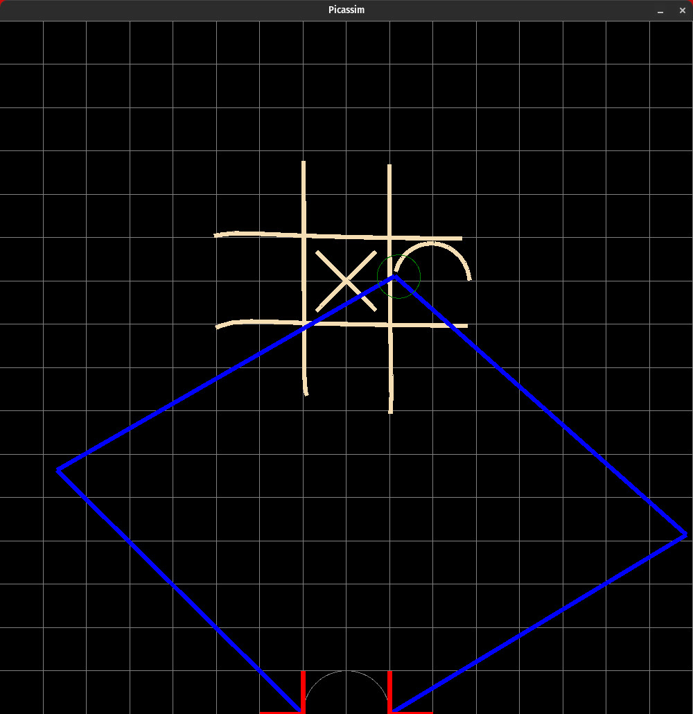

# `picassim` - A Drawing Robot Simulator

- Picassim is a simulator designed to be a drop in replacement for a painting/drawing robot that runs [jcode](github.com/JoshPattman/jcode).
- It allows simulation of various types of robot, each with physics-based kinematics (to try to make the simulator as accurate to a real robot as possible).

## Installation
- First clone the repo
- On linux (and probably mac too) you can run `$ make install`.
- On windows, you will need to run `$ make build` and then copy the binary in `bin/` to wherever it needs to go.

## Usage
- Once installed, you can run `picassim -h` to list all arguments.
- Running `$ picassim` will create a file called `robots.json` - this is a file where you can set up the different robots for your sim.
- Running `$ picassim -robot <robot name>` will run the sim with one of the named robots from your robots file
- Picassim works by reading `jcode` instructions from stdin. You can either just run the program and type your commands, or you can pipe in a set of commands.
    - For example, `$ cat example_jcode/test.jcode | picassim`
    - For example, `$ python example_jcode/xoxo.py | picassim`

## Important Notes
- Before you try to move the end effector of the robot, you must first set a speed for it to move at, for example `S 1;`
- It is possible for the robots to try to move to places that are not possible, causing parts of the robot to disappear. I will try to fix this but its a known issue for now.